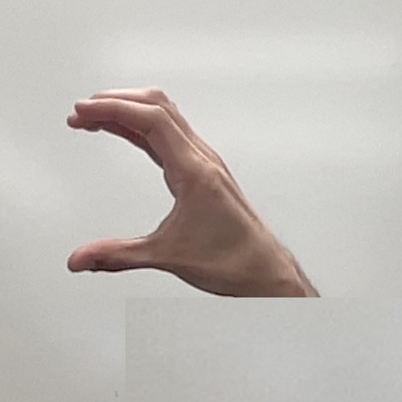
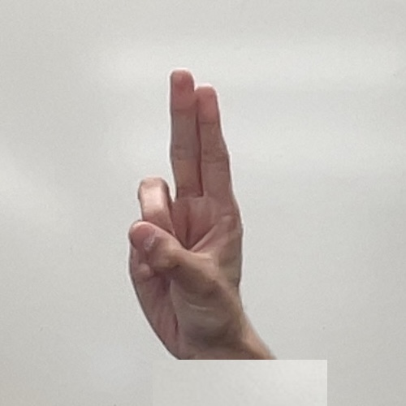

# CS 585: American Sign Language (ASL) Gesture Recognition Project

This repository contains the code and resources for the American Sign Language (ASL) gesture recognition project completed as part of the CS 585 Image & Video Computing course in Spring 2024. The goal of this project was to recognize multiple ASL gestures, specifically the letters **B**, **U**, **C**, and **V**, using image processing and computer vision techniques.

## Project Structure

```bash
├── A2.ipynb               # Jupyter notebook containing the implementation and experiments
├── B_img.jpg              # Image of the ASL sign for B
├── C_img.jpg              # Image of the ASL sign for C
├── U_img.jpg              # Image of the ASL sign for U
├── V_img.jpg              # Image of the ASL sign for V
├── README.md              # Project README (this file)
├── Final recording.mov    # Video showing the final results of the project
├── A2 project report.pdf  # Detailed project report describing the methods and experiments
```

## Problem Definition

The purpose of this project was to build a system that could recognize a set of hand gestures from American Sign Language (ASL), namely the letters **B**, **U**, **C**, and **V**. This recognition system could be used to develop an ASL-to-English translator, helping individuals with hearing impairments communicate through gestures in video-based systems.

The application assumes users are seated in a well-lit environment with a dark background, and the hands are a consistent distance from the screen. The project uses template matching and circularity measurement techniques to recognize the gestures.

## Methodology

1. **Template Matching**:
   - The primary gesture recognition method is based on matching the hand gestures against predefined templates.
   - We generated templates for each hand sign with a clear background.
   - The `template_matcher()` function matches each input frame to these templates and identifies the gesture.

2. **Circularity Measurement**:
   - Circularity is used to further distinguish between gestures that are similar in appearance, such as **B** and **U**.
   - The formula for circularity is used to calculate the roundness of the hand gesture:
        $$\text{Circularity} = \frac{{\text{perimeter}}^2}{4 \pi \times \text{area}}$$
   - This measurement helps disambiguate between gestures by checking their shape characteristics.

3. **Skin Detection**:
   - A simple skin detection algorithm was implemented to filter out background noise and highlight the hand in each frame.
   - The skin detection algorithm outputs a binary image where hand regions are highlighted.

4. **Preprocessing**:
   - The templates are preprocessed using erosion, dilation, and Gaussian blurring to reduce noise and improve matching accuracy.

## Experiments and Results

Multiple experiments were conducted to evaluate the performance of the system:

- Initially, template matching alone was unreliable, especially when hands were far from the camera or lighting conditions varied.
- The addition of skin detection and circularity measurement improved the recognition rate.
- The final system achieved high accuracy across all gestures except **V** and **U**, which were occasionally confused due to their similar shapes.

Images of the ASL signs used are included in the repository:

| ASL Sign for B | ASL Sign for C |
|----------------|----------------|
|  |  |

| ASL Sign for U | ASL Sign for V |
|----------------|----------------|
|  |  |

A video demonstrating the project can be found in `Final recording.mov`.

## Strengths and Weaknesses

### Strengths:
- The system works well for both users involved in the project, demonstrating robustness across individuals.
- High accuracy for most gestures under controlled conditions.

### Weaknesses:
- The system requires controlled lighting and background conditions for optimal performance.
- Gestures may be misclassified if the user is too far from the camera or rotates their hand too much.

## Future Improvements

- Implement a more advanced skin detection algorithm that can handle various lighting conditions and backgrounds.
- Increase the number of templates to test the scalability of the system.
- Explore additional feature extraction techniques to improve recognition accuracy.

## License

This project is licensed under the MIT License. See the [LICENSE](LICENSE) file for details.

## Contributors

- Abdelazim Lokma
- Risheet Nair
